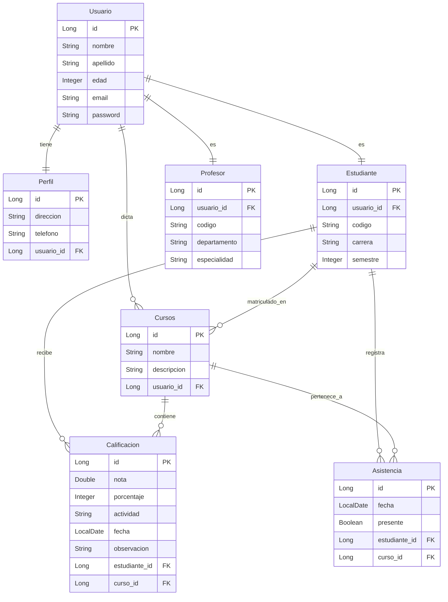

# Diagrama de Base de Datos - Backend EduPerformance

Este documento describe el esquema relacional actual implementado en el backend de EduPerformance.

## Tablas principales

- **Usuario**: datos base de cada persona del sistema.
- **Perfil**: datos personales complementarios del usuario.
- **Estudiante**: rol académico con matrícula, carrera y semestre.
- **Profesor**: rol académico con departamento y especialidad.
- **Cursos**: cursos asociados a un profesor.
- **Calificaciones**: notas de estudiantes por curso y actividad.
- **Asistencias**: registro de presencia/ausencia por curso.
- **estudiante_curso**: tabla intermedia para la relación N:M entre estudiantes y cursos.

## Esquema relacional actual

## Relaciones clave

- `Usuario` mantiene relaciones uno a uno con `Perfil`, `Estudiante` y `Profesor`.
- `Cursos` es dictado por un `Usuario` (profesor) mediante la columna `usuario_id`.
- `Estudiante` se matricula en `Cursos` con la tabla intermedia `estudiante_curso`.
- `Calificacion` y `Asistencia` tienen referencias directas a `estudiante_id` y `curso_id`.
